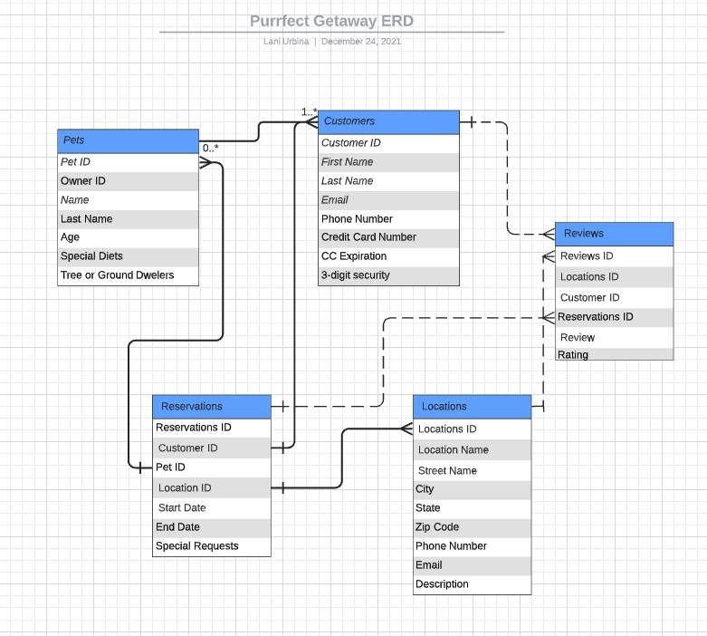

This is a [Next.js](https://nextjs.org/) project bootstrapped with [`create-next-app`](https://github.com/vercel/next.js/tree/canary/packages/create-next-app).

# Ringo-Capstone
[Heroku Lab link](https://the-purrfect-getaway.herokuapp.com/)

# Your Purrfect Getaway
## 2.0
Your Purrfect Getaway is the AirBnB for your Purr Baby. Find a safe stay for your cat at any destination you are traveling to. These Getaways are strictly boarding for felines. There is no added stress of dogs barking or attention going to a multitude of animals. Each location can host your cat or cats in private and peaceful rooms. 

You can sign up to be a Host and provide the Purrfect Getaway for those searching to bring their Purr Baby with them during travel or who need someone to watch their baby while they are gone. 

- Consumer Site with User Accounts
- Host Site with Host Accounts
- ✨Purrrr

## Features

- Visit the Site and Browse Locations
- Create a User Account to book your Purrfect Getaway
- View different destinations and reserve your stay
- Create a Host Account to add your location for a stay

### **Technologies Used**
        NextJS |  connect-mongo  |  dotenv  |  Sass  |  express  |  Next-Auth
        React |  moment  |  mongoose  |  mongoDB  |  heroku  |  HTML5 
        CSS |  javascript | React-Hooks | React-Router |React-DOM | react-responsive-carousel
        cors | morgan |JSON

### Lucid Chard - Wire Frame and ERD   
 

### Route Table
| Route Tabel | Routes        |Routes       |
|-------------| --------------|-------------|
|   GET       | /Locations    |/Users       |
|   GET       | /locations/:id|/Users/:id   |
|   PUT       | /locations/:id|/Users/:id   |
|   POST      | /locations    |/Users       |
|   DELETE    | /locations/:id|/Users/:id   |
|   GET       | /Hosts        |/Pets        |
|   POST      | /Hosts        |/Pets        |
|   PUT       | /Hosts/:id    |/Pets/:id    |
|   DELETE    | /Hosts/:id    |/Pets/:id    |

        ## **Getting Started**
To get started, please visit:
[Your Purrfect Getaway]()

### As a Consumer
1. Signup - create a username and password
2. Login - Enter your username and password
3. Add a Purr baby to your account (with edit/delete)
4. View locations
5. Reserve a location (with cancel option)
### Become a Host
1. Signup - create a username and password
2. Login - Enter your username and password 
6. Add your location 
7. Edit your location 
8. Delete your location
7. Signout

### **Future Enhancements**
More CSS for better consumer experience. Reservce by calendar dates with true availability. 
Password Resets using Twilio. 